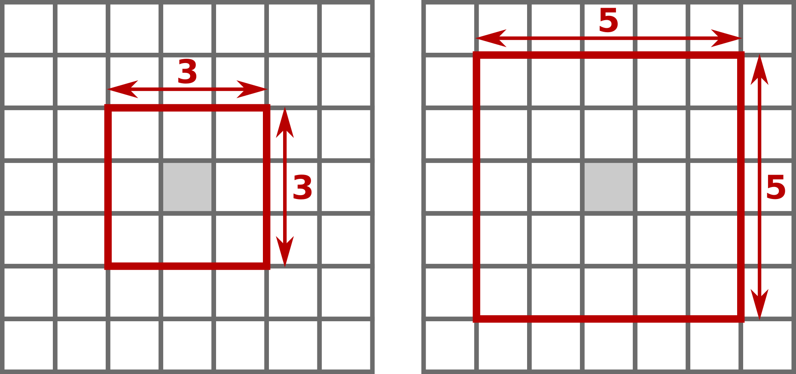
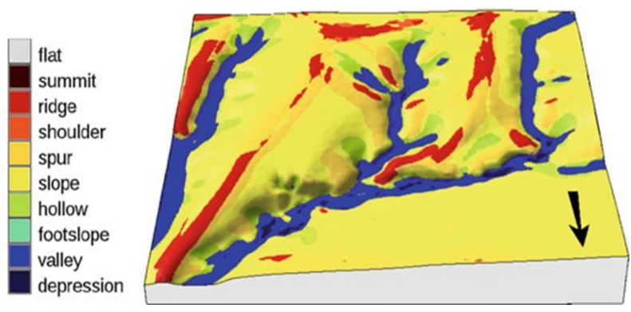

```{r setup, include=FALSE}
knitr::opts_chunk$set(echo = TRUE)
```

Photographie : Pyrénées ariégeoises (cliché D. Birre, 2021)

# Importance du relief dans la compréhension des processus bio-physiques

La caractérisation des formes du relief pour une région donnée est une tâche importante pour la compréhension des processus bio-physiques agissant sur ce territoire. Tout d'abord, les formes du relief actuelles résultent de processus s'étant déroulés dans le passé sur des échelles spatio-temporelles plus ou moins larges. Des territoires marqués par des épisodes glaciaires, des transgressions marines ou des longues périodes d'aridité présenteront des formes bien caractéristiques. Être capable de les lire nous renseigne immédiatement sur leurs histoires. Par exemple, un territoire sur lequel le géomorphologue identifie la présence de drumlins, est un territoire qui a été englacé dans un passé plus ou moins lointain. Ces formes peuvent également nous renseigner sur les dynamiques actuelles Ainsi, un banc de sable ou de galets au milieu d'une rivière nous indique que ce cours d'eau est sujet à des épisodes de hautes eaux présentant une énergie suffisante pour entraîner des sédimentes plus ou moins gros.

Les formes du relief ont aussi un impact fort sur les processus hydrologiques. L'eau, par définition, suit les plus fortes pentes au sein d'une région donnée. Identifier les formes en creux sur un versant, ainsi que leurs pentes, nous permettent d'identifier les chemins empruntés par les flux d'eau. Ces chemins, en retour, seront plus sujets à l'érosion hydrique que les régions voisines et pourvoiront les flux d'eau en sédiments et nutriments. Au contraire, les zones de replats ou de cuvettes seront des zones d'étalement et des zones de pièges à sédiments et à nutriments. La présence d'eau sur des terrains pentus pourra également influer sur les mouvements de terrain, tels que les éboulements ou les coulées de boues.

La géomorphologie a également un impact sur le climat local. Les zones sommitales ou les lignes de crêtes sont plus sujettes aux vents forts que les bas de versants par exemple. De même, les creux de versants ou les dépressions pourront avoir des températures plus basses que les zones alentours du fait d'une moins forte exposition aux rayons solaires ou de la subsidence de l'air froid. Cet impact sur le micro-climat aura, à son tour, des répercussions sur la biogéographie et la répartition des espèces. Certaines d'entre elles se développeront mieux dans les zones ensoleillées que les zones en ombre. D'autres, au contraire, profiteront de la position d'abri qu'offrent les creux de versants.

Enfin, la caractérisation des formes du relief d'un territoire donné intervient également dans les logiques de localisation de certains aménagements, telles que les éoliennes ou les infrastructures de transport.

# Techniques de caractérisation du relief basées sur les MNT

La caractérisation automatique des formes du relief se fait dans la plupart des cas sur des rasters de MNT (*Modèles Numériques de Terrain*). Sur un raster de MNT, à chaque pixel est associée une valeur représentant son altitude. Ainsi, en comparant les valeurs d'un pixel aux valeurs des pixels voisins, il est possible d'en dériver des caractéristiques géomorphologiques.

## Techniques basées sur des fenêtres glissantes

La plupart des techniques historiques de caractérisation du relief sont basées d'une part sur des calculs morphométriques (pente, orientation, exposition, profil), et d'autre part sur des analyses de voisinage basées sur le concept de fenêtres glissantes.  Ces méthodes de classification automatique du relief peuvent être basées sur la valeur locale de la pente et de la courbure (convexité) du terrain (Dikau, 1991 ; Wood, 1996) ou en comparant ces valeurs au voisinage.

L'analyse de voisinage utilise la technique des *fenêtres glissantes* (Figure 1). La valeur de chaque pixel est comparée aux valeurs des pixels adjacents. Selon la taille de la fenêtre glissante définie par l'utilisateur, les pixels adjacents peuvent être ceux touchant directement le pixel initial (*fenêtre 3×3*) ou tous les pixels situés à moins de deux pixels du pixel initial (*fenêtre 5×5*).

<figure class="center">
  
  <figcaption style="font-size:13px;">*Figure 1 : Analyse de voisinage avec une fenêtre glissante de 3×3 pixels (à gauche) et avec une fenêtre glissante de 5×5 pixels à droite*.
  </figcaption>
</figure>

Ces méthodes ont l'avantage d'être relativement simples à mettre en place, mais ont l'inconvénient d'être gourmandes en ressources. De plus, elles sont très contraintes par la résolution des MNT d'entrée et par la taille des fenêtres glissantes choisie. Ainsi, pour un même terrain, le résultat pourra être très différent selon la résolution du MNT d'entrée et selon le choix de la taille de fenêtre glissante choisie par l'utilisateur. Cette approche présente aussi le désavantage de mettre en évidence les *petits* reliefs, de l'ordre de taille de la fenêtre glissante, au détriment des grandes formes de relief du paysage.

## Techniques par identification de *geomorphons*

L’algorithme ***Geomorphons***, pour *geomorphologic phonotypes*, est une méthode qui identifie les formes du relief en utilisant un schéma de reconnaissance développé par Jasiewicz et Stepinski (2013). Ces formes de relief sont appelés *geomorphons* par les auteurs. L'avantage ce cette méthode est qu'elle n'est pas figée sur une valeur donnée de fenêtre glissante mais adapte la distance à prendre en compte grâce au concept de *ligne de mire*.

Ici, nous appliquerons cette méthode à nos trois bassins-versants. Un des premiers usages de l’algorithme fut la création de la carte géomorphologique de la Pologne (Jasiewicz and Stepinski, 2013). Il a aussi été utilisé pour décrire le relief du Monténégro (Frankl *et al*., 2016). Puis l'algorithme a été utilisé pour identifier certaines formes spécifiques du paysage, comme des drumlins (Sarasan *et al*., 2018) ou des surfaces plates (Veselsky *et al*., 2015). Bandura (2016) l’a aussi utilisé pour identifier et délimiter des sommets dans les montagnes slovaques. Cette méthode a également été mobilisée pour détecter des objets à une échelle plus fine : des formes à la surface d’un glacier (Gawrysiak, 2020), des traces de barrages organisés par des castors (Swift, 2021), ou bien encore la détection de formes fluviales côtières (Gioia, 2021).

Les *geomorphons* sont déterminés par une méthode de classification semi-automatique du modèle numérique de terrain (MNT). Cette méthode ne prend pas en compte les valeurs des pixels voisins mais s’inspire du principe de "ligne de mire". La méthode est flexible et s’adapte à différents terrains car le critère de la “ligne de mire” est plus souple que le critère de la “fenêtre glissante” fixe que l’on trouve dans les autres méthodes de classification. Elle adapte la distance à prendre en compte selon la notion de *terrain openess*. Il s’agit de calculer le rapport l’angle au zénith (Φ : *zenith angle*) et l’angle au nadir (Ψ : *nadir angle*) au sein d’un rayon de recherche défini par l’utilisateur (*lookup distance*). Le rayon est égal à *x* fois la largeur d’un pixel. Par exemple, choisir une *lookup distance* de 10 pour un MNT d’une résolution de 5 mètres revient à choisir une *lookup distance* de 50 mètres. De plus, le paramètre *threshold angle* permet de définir le niveau minimum de planéité souhaité permettant de gommer les aspérités microtopographiques. 

Cette méthode compare chaque pixel du MNT aux huit valeurs des voisins visibles les plus lointains, au maximum jusqu'à la *lookup distance* définie par l'utilisateur. La figure 2 présente les 10 résultats types d'une telle analyse. Les altitudes équivalentes à la valeur de la cellule centrale sont représentées par un point vert, celles plus basses en bleu et celles plus hautes en rouge.

<figure class="center">
  
  <figcaption style="font-size:13px;">*Figure 2 : Les 10 geomorphons identifiés par la méthode. Par exemple pour le Pic (Peak), tous les pixels voisins sont plus bas que le pixel central, leurs altitudes relatives sont donc représentées en bleu. Pour la Vallée (Valley), deux pixels sont d'altitudes équivalentes donc représentés en vert et les autres sont plus hauts, donc représentés en rouge (figure reprise de Jasiewicz et Stepinski (2012))*.  
  </figcaption>
</figure>

Ces 10 *geomorphons types* sont identifiables sur les rasters produits par l'algorithme (Figure 3).

<figure class="center">
  
  <figcaption style="font-size:13px;">*Figure 3 : Exemple d'un raster présentant les 10 geomorphons types tels que calculés par l'algorithme (figure reprise de Jasiewicz et Stepinski (2012))*.  
  </figcaption>
</figure>

# Objectifs de cette fiche

L'objectif de cette analyse est de caractériser et de quantifier les formes de relief grâce à la technique des *geomorphons* pour trois bassins-versants montagnards. Les trois bassins choisis sont le [Ribérot](https://fr.wikipedia.org/wiki/Riberot) dans les Pyrénées, la [Séveraisse](https://fr.wikipedia.org/wiki/S%C3%A9veraisse) dans les Alpes et la [Tarentaine](https://fr.wikipedia.org/wiki/Tarentaine) dans le Massif Central. Ces trois bassins sont faiblement anthropisés et présentent des formes de reliefs et des altitudes variées. Pour chacun de ces bassins, la proportion de chaque classe de relief sera calculée. Nous tenterons ainsi de voir si les trois bassins partagent des traits communs et quelles peuvent être les spécificités topographiques de chacun.

# Outil utilisé et données

## L'algorithme Geomorphon

L'algorithme *Geomorphon* est disponible dans les logiciels [GRASS GIS](https://grass.osgeo.org/grass82/manuals/r.geomorphon.html), [SAGA GIS](https://saga-gis.sourceforge.io/saga_tool_doc/7.3.0/ta_lighting_8.html) et [WhiteboxTools](https://giswqs.github.io/whiteboxR/reference/wbt_geomorphons.html). Ici, nous avons décidé d'utiliser le module proposé par GRASS GIS. Or GRASS GIS étant interfacé par QGIS, nous allons utiliser la librairie *QGIS process* qui permet d'utiliser facilement des algorithmes de QGIS depuis R. Ainsi, *Geomorphons*, disponible dans l’application GRASS GIS sera appelé dans R *via* la librairie *qgisproceess*.

La première chose à faire est d'installer cette librairie. Elle n'est pas disponible sur les dépôts officiels, il faut donc l'installer depuis son dépôt sur GitHub. Cela se fait avec le script suivant, comme expliqué [ici](https://paleolimbot.github.io/qgisprocess/).

```{r message=F, warning=F, echo=T, results='hide'}
# install.packages("remotes")
# remotes::install_github("paleolimbot/qgisprocess")
```

Pour vérifier sa bonne installation, il est possible d'afficher la configuration de l'installation, comme présenté ci-dessous.

```{r message=F, warning=F, echo=T, results='hide'}
# library(qgisprocess)
# qgis_configure()
```

Nous en profitons pour charger dès maintenant les différentes librairies dont nous aurons besoin par la suite.

```{r message=F, warning=F, echo=T, results='hide'}
# chargement de la librairie sf pour la manipulation de couches vecteurs
library(sf)
# chargement de la librairie terra pour la manipulation de raster
library(terra)
# chargement de la librairie tmap pour la création de cartes
library(tmap)
# chargement de la librairie tidyverse pour la manipulation de dataframes
library(tidyverse)
# chargement de la librairie reshape2 qui permet de modifier la structure des dataframes
library(reshape2)
# chargement de la librairie ggplot2 pour les graphiques
library(ggplot2)
```

## Données mobilisées

Dans ce projet, nous avons besoin de deux types de données :
* les limites des bassins-versants
* les MNT des bassins-versants

### Les bassins versants issus de la BD Topage® de l'IGN-F

Les limites des bassins-versants proviennent de la [BD Topage®](https://www.sandre.eaufrance.fr/actualite/diffusion-de-la-1%C3%A8re-version-de-la-bd-topage%C2%AE-m%C3%A9tropole), référentiel hydrographique français, en remplacement du référentiel BD Carthage®. Parmi cette base de données, nous téléchargeons la couche *Bassins versant topographiques - Métropole 2019 - BD Topage®* au format *GeoPackage*. Cette couche se nomme *BassinVersantTopographique_FXX.gpkg*. Dans cette couche, nous trouvons l'attribut *TopoOH* qui contient le toponyme de chaque bassin. Nous nous baserons sur cet attribut pour extraire les bassins de cette étude.

Pour rappel, nous travaillons ici sur trois bassins-versants : 
* un bassin-versant pyrénéen : le Ribérot (49 km<sup>2</sup>), situé en Ariège. Il prend sa source au mont Valier (2838 m).
* un bassin-versant alpin : la Séveraisse, du torrent de Navette au Drac (107 km<sup>2</sup>). Elle prend sa source dans les glaciers des Écrins.
* un bassin-versant du Massif Central : la Tarentaine, de sa source au confluent de l'Eau Verte (44 km2). Elle prend sa source à 1785 m dans les monts Dore.

### Le MNT RGE de l'IGN à 5m

Le calcul des *geomorphons* se fait à partir d'un modèle numérique de terrain. Aujourd'hui, des MNT de très haute résolution sont couramment produits et sont disponibles relativement facilement. L'IGN met à disposition gratuitement des MNT de très haute résolution (1m, 5m) sur [l'intégralité du territoire français](https://geoservices.ign.fr/rgealti). Nous travaillons ici sur le MNT à la résolution de 5m nommé *RGE ALTI® 5 m*. À l'échelle des bassins étudiés, cette résolution est tout à fait suffisante. Notons que le RGE est concrètement un *modèle numérique d'élévation*, prenant donc en compte notamment les bâtiments et les infrastructures. Néanmoins, nos bassins étant peu anthropisés, nous pourrons nous contenter de cette donnée.

# Mise en application

Nous commencerons par préparer nos données afin de disposer d'un MNT à 5 m par bassin-versant. Ensuite, nous calculerons les geomoprhons sur chacun de nos trois MNT. Enfin, nous calculerons quelques statistiques descriptives du relief de nos trois bassins.

## Préparation des données

### Extraction des bassins de la BD TOPAGE

Nous commençons par charger la couche des bassins-versants à l'échelle de la France métropolitaine issue de la BD TOPAGE. Nous la chargeons sous la forme d'un objet *sf*.

```{r message=F, warning=F, echo=T, results='hide'}
# chargement de la couche des bassins de toute la France
bv <- st_read("data/BassinVersantTopographique_FXX.gpkg")
```

Cette couche contient un attribut *TopoOH* qui contient le nom des bassins-versants. Dans cette couche, nos trois bassins sont identifiés avec les noms suivants :

* Ribérot : *Le Ribérot*
* Séveraisse : *La Séveraisse de sa source au torrent de Navette inclus)*
* Tarentaine : *La Tarentaine (Trentaine) de sa source au confluent de l'Eau Verte*

Nous allons ainsi faire trois sélections attributaires afin d’individualiser nos trois bassins. Nous ferons ces sélections grâce à la fonction *filter* de la librairie *dplyr*.

```{r message=F, warning=F, echo=T, results='hide'}
# extraction du bassin du Ribérot selon son nom
riberot <- bv %>% filter(bv$TopoOH == "Le Ribérot")
# export du bassin du Ribérot en une couche autonome (facultatif)
st_write(riberot, "data_processed/bv_riberot.gpkg", delete_layer = TRUE)

# extraction du bassin de la Séveraisse
severaisse <- bv %>% filter(bv$TopoOH == "La Séveraisse de sa source au torrent de Navette inclus")
st_write(severaisse, "data_processed/bv_severaisse.gpkg", delete_layer = TRUE)

# extraction du bassin de la Tarentaine 
tarentaine <- bv %>% filter(bv$TopoOH == "La Tarentaine (Trentaine) de sa source au confluent de l'Eau Verte")
st_write(tarentaine, "data_processed/bv_tarentaine.gpkg", delete_layer = TRUE)
```

### Création du raster virtuel de MNT

Une fois les limites des bassins-versants individualisées, nous allons construire les MNT correspondants. Pour cela, il est nécessaire de télécharger le modèle numérique de terrain de chaque département depuis le site des [Géoservices de l'IGN-F](https://geoservices.ign.fr/rgealti). En effet, l'IGN oblige à télécharger les MNT département par département. Il n'est pas possible de télécharger seulement le MNT d'une zone d'intérêt. Nos trois bassins se trouvent respectivement dans les départements suivants :

* Ribérot : Ariège (09)
* Séveraisse : Hautes-Alpes (05)
* Tarentaine : Puy-de-Dôme (63)

Pour chaque département, le MNT est découpé en dalles carrées. Une fois l'ensemble des dalles téléchargées, il faut créer un raster virtuel par département, comme présenté dans le code ci-après. C'est ensuite ce raster virtuel que nous découperons selon les limites de nos bassins.


```{r message=F, warning=F, echo=T, results='hide'}
library(qgisprocess)
# Pour le département de l'Ariège (09)
# indication du répertoire contenant les dalles de MNT de l'Ariège
path_dem_09 <- "/data/RGE_5m_Dep09/"

# nous transformons ce chemin en chemin abslou
path_dem_09 <- paste(getwd(),"/data/RGE_5m_Dep09/", sep="")

# le nom et le chemin du raster virtuel qui sera produit
dem_09 <- "data_processed/RGE_5m_Dep09.vrt"

# nous construisons la liste de toutes les dalles de MNT du département
ras_lst <- list.files(path_dem_09, full.names = T, pattern = ".asc$", recursive=T)

# nous construisons le raster virtuel de l'Ariège via QGIS process
qgis_run_algorithm("gdal:buildvirtualraster",
               	INPUT = ras_lst,
               	SEPARATE=FALSE,
               	ASSIGN_CRS='EPSG:2154',
               	OUTPUT=dem_09)
```

Nous procédons de même pour le département des Hautes-Alpes.

```{r message=F, warning=F, echo=T, results='hide'}
# Pour le département des Hautes-Alpes (05)
# indication du répertoire contenant les dalles de MNT des Hautes-Alpes
path_dem_05 <- "/data/RGE_5m_Dep05/"

# transformation de ce chemin en chemin absolu
path_dem_05 <- paste(getwd(),"/data/RGE_5m_Dep05/", sep="")

# le nom et le chemin du raster virtuel qui seront produits
dem_05 <- "data_processed/RGE_5m_Dep05.vrt"

# construction de la liste de toutes les dalles de MNT du département
ras_lst <- list.files(path_dem_05, full.names = T, pattern = ".asc$", recursive=T)

# construction du raster virtuel des Hautes-Alpes via QGIS process
qgis_run_algorithm("gdal:buildvirtualraster",
               	INPUT = ras_lst,
               	SEPARATE=FALSE,
               	ASSIGN_CRS='EPSG:2154',
               	OUTPUT=dem_05)
```

Enfin, nous procédons pareillement pour le département du Puy-de-Dôme.

```{r message=F, warning=F, echo=T, results='hide'}
# Pour le département du Puy-de-Dôme (63)
# indication du répertoire contenant les dalles de MNT du Puy-de-Dôme
path_dem_63 <- "/data/RGE_5m_Dep63/"

# transformation de ce chemin en chemin absolu
path_dem_63 <- paste(getwd(),"/data/RGE_5m_Dep63/", sep="")

# le nom et le chemin du raster virtuel qui seront produits
dem_63 <- "data_processed/RGE_5m_Dep63.vrt"

# construction de la liste de toutes les dalles de MNT du département
ras_lst <- list.files(path_dem_63, full.names = T, pattern = ".asc$", recursive=T)

# construction du raster virtuel du Puy-de-Dôme via QGIS process
qgis_run_algorithm("gdal:buildvirtualraster",
               	INPUT = ras_lst,
               	SEPARATE=FALSE,
               	ASSIGN_CRS='EPSG:2154',
               	OUTPUT=dem_63)
```

À ce stade, nous disposons des MNT de chacun des départements contenant nos bassins. La prochaine étape va consister à extraire seulement les MNT selon les limites de nos trois bassins.

## Découpage des MNT selon l'emprise des bassins-versants

Nous avons maintenant les limites de nos trois bassins, récupérées grâce à la BD TOPAGE, ainsi que les MNT de leurs départements d'appartenance. Le but est maintenant d'extraire les MNT de nos bassins et seulement de nos bassins.

```{r message=F, warning=F, echo=T, results='hide'}
# si les limites des bassins ne sont plus chargées dans le projet, nous pouvons les recharger en réactivant (c'est-à-dire en supprimant le #) les lignes suivantes :
#riberot <- st_read("data_processed/bv_riberot.gpkg")
#severaisse <- st_read("data_processed/bv_severaisse.gpkg")
#tarentaine <- st_read("data_processed/bv_tarentaine.gpkg")

# chargement du MNT virtuel de l'Ariège
dem_09 <- rast("data_processed/RGE_5m_Dep09.vrt")
# conversion des limites du Ribérot en un objet SpatVector utilisable par terra
riberot <- vect(riberot)
# découpage de ce MNT selon l'étendue spatiale des limites du Ribérot
dem_riberot <- crop(dem_09, riberot)
# masque du MNT selon les limites du Ribérot
dem_riberot <- mask(dem_riberot, riberot)
# export du MNT (facultatif)
terra::writeRaster(dem_riberot,
      "data_processed/dem_Riberot.tif",
      filetype = "GTiff", 
      overwrite = TRUE)

# chargement du MNT virtuel des Hautes-Alpes
dem_05 <- rast("data_processed/RGE_5m_Dep05.vrt")
# conversion des limites de la Séveraisse en un objet SpatVector utilisable par terra
severaisse <- vect(severaisse)
# découpage de ce MNT selon l'étendue spatiale des limites de la Severaisse
dem_severaisse <- crop(dem_05, severaisse)
# masque du MNT selon les limites de la Severaisse
dem_severaisse <- mask(dem_severaisse, severaisse)
# export du MNT (facultatif)
terra::writeRaster(dem_severaisse,
      "data_processed/dem_Severaisse.tif",
      filetype = "GTiff",
      overwrite = TRUE)

# chargement du MNT virtuel du Puy-de-Dôme
dem_63 <- rast("data_processed/RGE_5m_Dep63.vrt")
# conversion des limites de la Tarentaine en un objet SpatVector utilisable par terra
tarentaine <- vect(tarentaine)
# découpage de ce MNT selon l'étendue spatiale des limites de la Tarentaine
dem_tarentaine <- crop(dem_63, tarentaine)
# masque du MNT selon les limites de la Tarentaine
dem_tarentaine <- mask(dem_tarentaine, tarentaine)
# export du MNT (facultatif)
terra::writeRaster(dem_tarentaine,
      "data_processed/dem_Tarentaine.tif",
      filetype = "GTiff",
      overwrite = TRUE)
```

Nous disposons maintenant des MNT découpés selon chacun de nos bassins-versants. Nous pouvons passer au traitement des *geomorphons*.

## Le traitement Geomorphon : détection des 10 formes de reliefs

À partir du MNT de chaque bassin-versant, nous pouvons lancer l'analyse des formes de reliefs grâce à l'algorithme *Geomorphon*. Nous utiliserons son implémentation dans GRASS GIS à l'aide de la librairie *qgisprocess*. Nous allons ainsi obtenir le raster des 10 formes de reliefs telles que répertoriées par *Geomorphons* pour chacun de nos bassins.

L'utilisateur doit spécifier une distance de recherche, c'est-à-dire la distance maximale sur laquelle une forme de relief doit être recherchée. Ici, nous pouvons la spécifier à 20 pixels, ce qui équivaut à une distance de recherche de 100 mètres, car un pixel mesure 5 mètres de côté.

```{r message=F, warning=F, echo=T, results='hide'}
# Analyse des geomorphons du Ribérot
# le chemin et le nom du raster de geomorphons en sortie
geom_riberot <- "data_processed/geomorphons_Riberot.tif"
qgis_run_algorithm("grass7:r.geomorphon",
                  elevation = dem_riberot,
                  search = 20, # lookup distance/rayon de recherche
                  flat = 1,
                  forms = geom_riberot)

# Analyse des geomorphons de la Séveraisse
# le chemin et le nom du raster de geomorphons en sortie
geom_severaisse <- "data_processed/geomorphons_Severaisse.tif"
qgis_run_algorithm("grass7:r.geomorphon",
                  elevation = dem_severaisse,
                  search = 20, # lookup distance/rayon de recherche
                  flat = 1,
                  forms = geom_severaisse)

# Analyse des geomorphons de la Tarentaine
# le chemin et le nom du raster de geomorphons en sortie
geom_tarentaine <- "data_processed/geomorphons_Tarentaine.tif"
qgis_run_algorithm("grass7:r.geomorphon",
                  elevation = dem_tarentaine,
                  search = 20, # lookup distance/rayon de recherche
                  flat = 1,
                  forms = geom_tarentaine)
```

Nous disposons à ce niveau de trois rasters présentant les 10 formes de relief pour chacun de nos bassins-versants. Selon l'algorithme *geomorphons*, ces 10 classes correspondent au tableau suivant.

| Classe de relief | Valeur de pixel | Code couleur par défaut |
|------------------|-----------------|-------------------------|
| Plan             | 1               | #dcdcdc                 |
| Sommet           | 2               | #380000                 |
| Crête            | 3               | #c80000                 |
| Haut de versant  | 4               | #ff5014                 |
| Éperon           | 5               | #fad23c                 |
| Pente            | 6               | #ffff3c                 |
| Creux de versant | 7               | #b4e614                 |
| Bas de versant   | 8               | #3cfa96                 |
| Vallée           | 9               | #0000ff                 |
| Dépression       | 10              | #000038                 |

# Résultats

## Représentation cartographique

Nous pouvons représenter la répartition géographique des formes de reliefs de nos trois bassins en les cartographiant. Pour ce faire nous commençons par placer les noms et les couleurs des formes du relief disponibles dans *geomorphons* dans un vecteur *noms* pour les noms et *couleurs* pour les couleurs.

```{r, message=F, warning=F, echo=T, results='hide'}
noms = c("Plan", "Sommet", "Crête", "Haut de versant", "Eperon", "Pente", "Creux de versant", "Bas de versant", "Vallée", "Dépression")
couleurs = c("#dcdcdc", "#380000", "#c80000", "#ff5014", "#fad23c", "#ffff3c", "#b4e614", "#3cfa96", "#0000ff", "#000038")
```

Cela nous utilisons les lignes de commande suivantes.

```{r, message=F, warning=F, echo=T, results='hide'}
library(terra)
library(tmap)
# Cartographie du Ribérot
# Chargement du raster des geomorphons du Ribérot
geom_riberot <- rast("data_processed/geomorphons_Riberot.tif")
tm_shape(geom_riberot) + 
  tm_raster(style= "cat",
            labels = noms,
            palette = couleurs,
            title="Geomorphons du Ribérot") + 
  tm_compass(type = "4star", size = 1, position = c("right", "top")) +
  tm_scale_bar(breaks = 1) +
  tm_layout(legend.outside = T)

# Cartographie de la Séveraisse
# Chargement du raster des geomorphons de la Séveraisse
geom_severaisse <- rast("data_processed/geomorphons_Severaisse.tif")
tm_shape(geom_severaisse) + 
  tm_raster(style= "cat",
            labels = noms,
            palette = couleurs,
            title="Geomorphons de la Séveraisse") + 
  tm_compass(type = "4star", size = 1, position = c("right", "top")) +
  tm_scale_bar(breaks = 1) +
  tm_layout(legend.outside = T)

# Cartographie de la Tarentaine
# Chargement du raster des geomorphons de la Tarentaine
geom_tarentaine <- rast("data_processed/geomorphons_Tarentaine.tif")
tm_shape(geom_tarentaine) + 
  tm_raster(style= "cat",
            labels = noms,
            palette = couleurs,
            title="Geomorphons de la Tarentaine") + 
  tm_compass(type = "4star", size = 1, position = c("right", "top")) +
  tm_scale_bar(breaks = 1) +
  tm_layout(legend.outside = T)
```
Sur les trois bassins, la forme de relief dominante est clairement la "Pente", ce qui est tout à fait logique au vu du contexte montagnard de ces bassins. Ensuite, les grandes "Vallées" apparaissent clairement et laissent deviner le réseau hydrographique des bassins. Les grandes vallées sont séparées les unes des autres par des "Lignes de crête" et des "Éperons". Entre les lignes de crête et les vallées, outre les pentes, nous retrouvons fréquemment des "Creux de versant". Les autres classes sont, quant à elles, peu représentées.


## Comparaison quantitative des formes de reliefs

L'idée est maintenant de regarder si ces trois bassins montagnards partagent des traits de reliefs en commun ou s'ils sont très différents. Nous pouvons également nous demander si les deux bassins de haute montagne (Ribérot et Séveraisse) se démarquent par rapport à celui de moyenne montagne (Tarentaine).

Pour cette comparaison, nous allons calculer la superficie relative occupée par chaque forme de relief dans nos trois bassins. Nous allons utiliser la fonction *freq()* de la librairie *terra*, qui permet de calculer le nombre de pixels de chaque classe d'un raster et de récupérer ce résultat dans un *dataframe*.

Nous commençons par calculer le nombre de pixels de chaque classe pour le raster de *geomorphons* du Ribérot.

```{r message=F, warning=F}
relief_riberot <- freq(geom_riberot)
knitr::kable(relief_riberot, format = "html")
```

Nous obtenons bien un dataframe à trois colonnes. La première colonne (*layer*) est seulement utile si nous travaillons sur un raster multi-bandes, ce qui n'est pas le cas ici. La deuxième colonne (*value*) contient le nom des classes et la troisième (*count*) le nombre de pixels de chaque classe. Nous allons créer une nouvelle colonne nommée simplement *Ribérot* dans laquelle nous allons calculer la proportion de chaque classe, ce qui nous permettra de faire des comparaisons entre les bassins.

```{r message=F, warning=F}
library(tidyverse)
relief_riberot$Ribérot <- relief_riberot$count / sum(relief_riberot$count)

# Nous en profitons pour enlever les colonnes inutiles
relief_riberot <- relief_riberot %>% select(-one_of('layer', 'count'))
knitr::kable(relief_riberot, format = "html")
```

Nous procédons de même pour les deux autres bassins-versants.

```{r message=F, warning=F}
# Pour la Séveraisse
relief_severaisse <- freq(geom_severaisse)

relief_severaisse$Séveraisse <- relief_severaisse$count / sum(relief_severaisse$count)
relief_severaisse <- relief_severaisse %>% select(-one_of('layer', 'count')) 
knitr::kable(relief_severaisse, format = "html")

# Pour la Tarentaine
relief_tarentaine <- freq(geom_tarentaine)

relief_tarentaine$Tarentaine <- relief_tarentaine$count / sum(relief_tarentaine$count)
relief_tarentaine <- relief_tarentaine %>% select(-one_of('layer', 'count')) 
knitr::kable(relief_tarentaine, format = "html")
```

Nous allons maintenant assembler ces trois dataframes en un seul via une jointure attributaire sur le champ *value*. Nous pourrons ainsi comparer les proportions de chaque classe de relief dans nos bassins.

```{r message=F, warning=F}
# création d'une liste contenant les trois dataframes
relief_bassins <- list(relief_riberot, relief_severaisse, relief_tarentaine)
# grâce à la fonction 'reduce' de la librairie tidyverse
# jointure attributaire sur les dataframes en une seule fois
relief_bassins <- relief_bassins %>% reduce(full_join, by='value')

# nous renommons la colonne 'value' en 'relief'
relief_bassins <- rename(relief_bassins, 'relief' = 'value')
knitr::kable(relief_bassins, format = "html")
```

À partir de ce dataframe groupant les proportions de formes de reliefs des trois bassins, nous allons tracer des graphiques en bâtons de ces proportions. Nous utiliserons la librairie *ggplot2*. Cette librairie prend en entrée les dataframes au format *long*. C'est-à-dire des dataframes où les données sont organisées en lignes plutôt qu'en colonnes. Nous commençons donc par transformer le dataframe des formes de reliefs dans ce format grâce à la librairie *reshape2* et à sa fonction *melt*.

```{r message=F, warning=F}
relief_bassins_long <- melt(relief_bassins,
                            id.vars = c('relief'))
knitr::kable(relief_bassins_long, format = "html")
```

Nous pouvons maintenant tracer le graphique.

```{r message=F, warning=F}
ggplot(relief_bassins_long, aes(fill=variable, y=value, x=relief)) + 
  geom_bar(position='dodge', stat='identity') +
  theme_minimal() + 
  labs(x='Relief', y='Proportions', title='Proportions de reliefs par bassin') +
  theme(plot.title = element_text(hjust=0.5, size=20, face='bold')) +
  scale_fill_manual('Bassin-versant', values=c('coral2', 'steelblue', 'orange')) +
  theme(legend.position = c(.11, .85))
```

Au vu de ce graphique, les trois bassins sont largement similaires en termes de répartition de formes de reliefs. Cependant, en y regardant de plus près, le bassin de moyenne montagne, à savoir celui de la Tarentaine dans le Massif Central, présente une proportion de pentes (*slope*) moins importante que les bassins pyrénéen et alpin, respectivement représentés par le Ribérot et la Séveraisse. Le bassin de la Tarentaine présente 55 % de pentes contre un peu plus de 65 % pour les deux autres bassins. En contre partie, le bassin de la Tarentaine présente un peu plus d'éperons (*spur*) que les deux autres bassins. La proportion d'éperons est de 17.4 % pour la Tarentaine contre à peu près 14 % pour le Ribérot et la Séveraisse. Il en est de même pour les vallées (*valley*), où la proportion atteint 6 % pour la Tarentaine et seulement 1.5 à 2 % pour les deux autres bassins. Ces résultats sont tout à fait logiques au regard du contexte des trois bassins. En moyenne montagne, les pentes sont moins abruptes et les vallées plus larges, ce qui se reflète bien dans cette classification.

# Conclusion

Nous avons mis au point une chaîne de traitements permettant de classifier et de comparer les formes de reliefs pour différents bassins-versants. La méthode présentée ici part de l'extraction de bassins choisis par l'utilisateur à partir de la couche hydrographique nationale de référence que représente la BD TOPAGE. Cette chaîne de traitements permet ensuite de récupérer les modèles numériques de terrain pour ces bassins en se basant sur le RGE à 5 m fourni par l'IGN. Ensuite, pour chaque bassin, à partir de son MNT, est calculé le raster des formes de reliefs grâce à l'algorithme *geomorphons* implémenté dans GRASS GIS, interfacé par QGIS et appelé via la librairie *qgis_process* de R. Pour finir, les résultats ont été représentés sous forme de cartes et sous forme de graphiques en bâtons groupés.

# Bibliographie