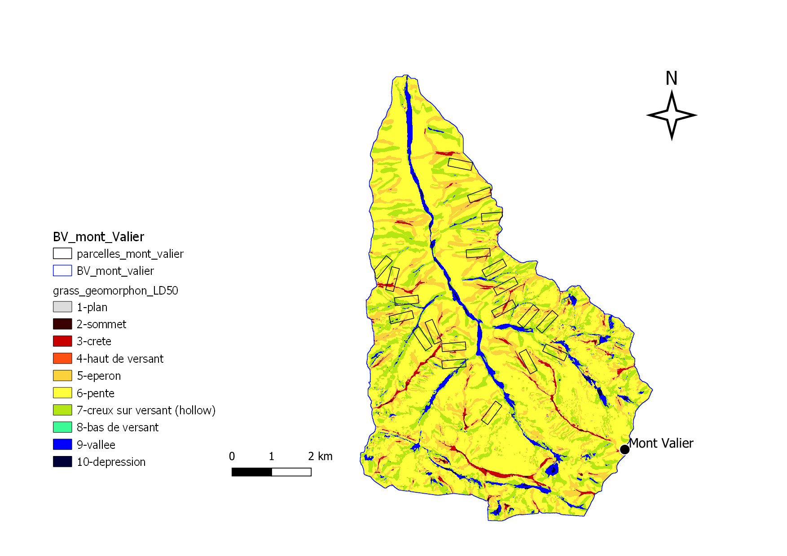

```{r setup, include=FALSE}
knitr::opts_chunk$set(echo = TRUE)
```

ICI Légende de la photo

R Markdown see <http://rmarkdown.rstudio.com>

# Importance du relief dans la compréhension des processus physiques

Définition d'un BV (Source?)

Le bassin versant ou bassin hydrographique, 
Une meilleure connaissance du relief d'un bassin versant permet de mieux comprendre les processus d'écoulement et d'identifier les zones d'accumulation des eaux.


# L'analyse du relief par le traitement *Geomorphon*

## Présentation du traitement *Geomorphon*

L’algorithme ***Geomorphons***, pour *geomorphologic phonotypes*, est une méthode qui identifie les formes du paysage en utilisant un schéma de reconnaissance développé par Jasiewicz et Stepinski (2012). 

L’algorithme des géomorphons permet d’étudier les formes du relief. Les images de très haute résolution sont aujourd’hui en forte croissance et sont disponibles relativement facilement. Nous avons décidé d’utiliser les géomorphons, qui est une méthode relativement récente (2012) comparée aux autres méthodes de classification automatique du relief basées sur la valeur de la pente et de la courbure du terrain (Dikau, 1991 ; Wood, 1996). Ces méthodes sont efficaces pour traiter de petits rasters mais fonctionnent moins bien dans le cadre de rasters à plusieurs millions de pixels : les calculs sont alors trop complexes et demandent trop de ressources pour identifier avec suffisamment de précision l’ensemble des formes du terrain. Un des premiers usages de l’algorithme fut la création de la carte géomorphologique de la Pologne (Jasiewicz and Stepinski, 2013). Il a été aussi utilisé pour décrire le Monténégro (Frankl et al., 2016). Puis l'algorithme a été utilisé pour identifier certaines formes spécifiques du paysage, comme des drumlins (Sarasan et al., 2018) ou des surfaces plates (Veselsky et al., 2015). Bandura (2016) l’a aussi utilisé pour identifier et délimiter des sommets dans les montagnes slovaques. Cette méthode a également été utilisée pour détecter des objets à une échelle plus fine : des formes à la surface d’un glacier (Gawrysiak, 2020), des traces de barrages organisés par des castors (Swift, 2021), ou bien encore la détection de formes fluviales côtières (Gioia, 2021).

Les géomorphons sont déterminés par une méthode de classification semi-automatique du modèle numérique de terrain (MNT). Cette méthode ne prend pas en compte les valeurs des cellules voisines mais s’inspire du principe de "ligne de mire". La méthode est flexible et s’adapte à différents terrains car le critère de la “ligne de mire” est plus souple que le critère de la “fenêtre fixe” que l’on trouve dans les autres méthodes de classification. Elle adapte la distance à prendre en compte selon la notion de « *terrain openess* ». Il s’agit de calculer le rapport entre ce qui est appelé l’angle au zénith (Φ : *zenith angle*) et l’angle au nadir (Ψ : *nadir angle*) au sein d’un rayon de recherche défini par l’utilisateur (*lookup distance*). Le rayon est égal à x fois la largeur d’un pixel. Par exemple, choisir une *lookup distance* de 10 pour un MNT d’une résolution de 5 mètres cela revient à choisir une *lookup distance* de 50 mètres. Aussi, le paramètre “*threshold angle*” permet de définir le niveau minimum de planéité souhaité permettant de gommer les aspérités microtopographiques. 

*Geomorphons* est disponible dans l’application SAGA (Système pour les Analyses Géoscientifiques Automatisées) que nous appelons *via* le package *qgisproceess*.


```
dem_geomorphons = qgis_run_algorithm("saga:geomorphons",
                                       DEM = DEM,
                                       THRESHOLD = 1, # fixe le seuil de planéité
                                       RADIUS = 60, # fixe le rayon de recherche
                                       METHOD = 1, #
                                       GEOMORPHONS = paste("nom", ".tif"))

```


## Les 10 formes du paysage obtenues par le traitement

Geomorphons compare chaque cellule du MNT aux huit valeurs des voisins visibles les plus lointains. Les altitudes équivalentes à la valeur de la cellule centrale sont représentées par un point vert, celles plus basses en bleu et celles plus hautes en rouge.

<figure class="center">
  
  <figcaption style="font-size:13px;">*Analyse diachronique de la parcelle 693. A : Orthophotographie actuelle (2016) ; B :
Raster historique : classification pixel forêt / pixel non forêt en 1955 ; C : Raster actuel reclassifié :
classification pixel forêt / pixel non forêt en 2015 ; D : Nouveau raster résultant de la somme du raster
B et du raster C : Diachronie avec 4 classes présentant la dynamique forestière*.  
  </figcaption>
</figure>


Selon la configuration des huit valeurs, dix formes peuvent être identifiées.

<figure class="center">
  
  <figcaption style="font-size:13px;">*Analyse diachronique de la parcelle 693. A : Orthophotographie actuelle (2016) ; B :
Raster historique : classification pixel forêt / pixel non forêt en 1955 ; C : Raster actuel reclassifié :
classification pixel forêt / pixel non forêt en 2015 ; D : Nouveau raster résultant de la somme du raster
B et du raster C : Diachronie avec 4 classes présentant la dynamique forestière*.  
  </figcaption>
</figure>


# Objectifs et données mobilisées

## Objectifs 

Le paysage est un agencement d’éléments abiotiques, biotiques et anthropiques, permettant le développement d’écosystèmes variés (Reynard, 2005). Il est  possible de cartographier des unités homogènes en classant le terrain en différents éléments du paysages (Evans *et al*., 2009). Etudier les formes du paysage permet alors de mieux comprendre la segmentation paysagère. 


## Données mobilisées

### RGE MNT 5m

Le calcul des géomorphons se fait à partir d'un modèle numérique de terrain. Aujourd'hui, l'IGN met à notre disposition des MNT de très grande résolution (1m, 5m) sur l'intégralité du territoire français (source).
Nous travaillons sur des MNT à la résolution de 5m (justification?)

Le MNT permet d'extraire de nombreuses informations : l'altitude, la pente, l'orientation. Il permet également de délimiter le réseau hydrographique, mais aussi différentes indicateurs topographiques : Topographic Wetness Index, Topographic Position Index, etc. 


### BD Topage®

Le découpage des bassins versants provient de la BD Topage® (Bassins versant topographiques - BD Topage - Métropole) qui vise à produire un nouveau référentiel hydrographique français, en remplacement du référentiel BD Carthage®. 


# Méthodologie

## Création du raster virtuel

To do : télécharger les données RGE 5m pour l'Yvette et pour le BV du Morvan. 

```
ras_lst <- list.files(c, full.names = T, pattern = ".asc$") # sélection de toutes les dalles
head(ras_lst)
terra::vrt(ras_lst, v, overwrite = T) # création du raster virtuel
ras <- raster(v)
plot(ras)
```

```{r, echo=FALSE}
library(terra)
r <- rast("data/mont_valier.tif")
plot(r)
```

## Découpage du raster par l'emprise d'un bassin versant

Clip / Crop

```
bv <- st_read("bv_riberot.shp")
mnt_bv <- raster::mask(ras, bv, filename = paste0("mnt_bv_riberot", ".tif")
```

```
plot(mnt_bv)

```

## Geomorphon


Traitement géomorphons : 
A partir du MNT, on fait tourner l'algorithme Geomorphon avec qgisprocess


# Résultats

## Résultats sur le bassin versant du Ribérot (milieu de haute montagne)

<figure class="center">
  
  <figcaption style="font-size:13px;">*Analyse diachronique de la parcelle 693. A : Orthophotographie actuelle (2016) ; B :
Raster historique : classification pixel forêt / pixel non forêt en 1955 ; C : Raster actuel reclassifié :
classification pixel forêt / pixel non forêt en 2015 ; D : Nouveau raster résultant de la somme du raster
B et du raster C : Diachronie avec 4 classes présentant la dynamique forestière*.  
  </figcaption>
</figure>

## Résultats sur le bassin versant du Morvan (milieu de moyenne montagne)


## Résultats sur le bassin versant de l'Yvette (milieu de plaine)


## Données comparatives sur trois bassins versants représentatifs de trois milieux différentes

Rendu pour les 3 BV : 

You can also embed plots, for example:

```{r pressure, echo=FALSE}
plot(pressure)
```

Note that the `echo = FALSE` parameter was added to the code chunk to prevent printing of the R code that generated the plot.


# Bibliographie


